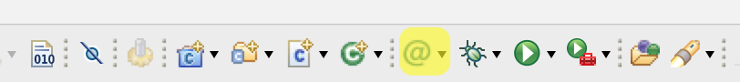

# AMS Board

QUTMS_AMS software and hardware repository

# Building Doxygen for AMS
### Via STM32CubeIDE
1. Download eclox via Eclipse Marketplace within STM32CubeIDE
2. When asked, restart STM32CubeIDE
3. Press the eclox button and select **update doxyfile**
4. Select the doxyfile located in `Software/Documentation/doxyfile`
5. Press the eclox button to build the documentation, which will generate in `Software/Documentation/Docs`.

**NOTE**
Generated Documentation is gitignored so it will not commit to git.

**eclox button (highlighted):**

### Via Doxygen CLI
1. Install doxygen for your system:
* MacOS: run `brew install doxygen`
* Ubuntu: run `sudo apt-get install doxygen`
* Windows: You're on your own.
2. cd to `QUTMS_AMS/Software/Documentation`
3. run `doxygen doxyfile`